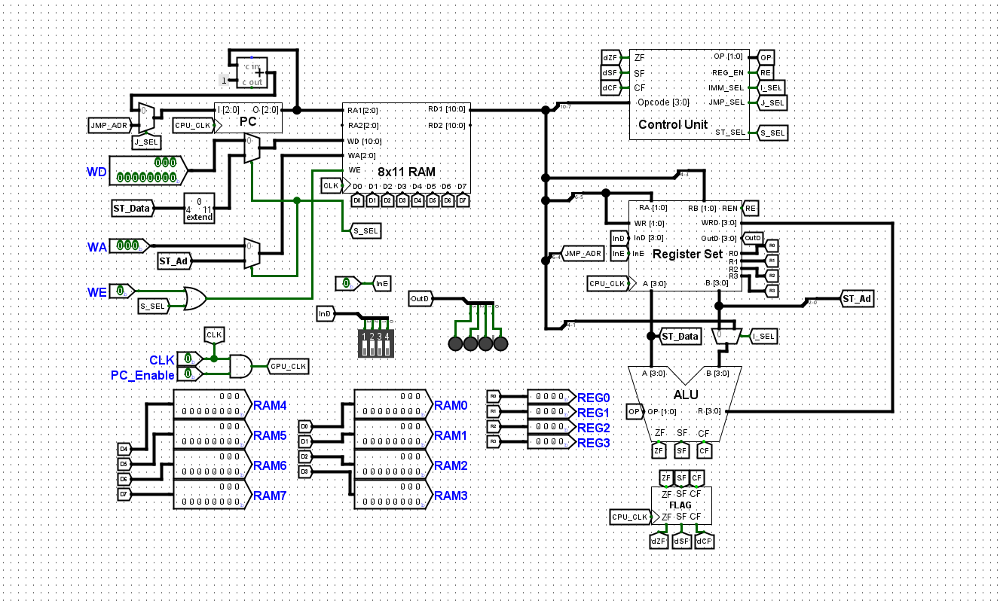
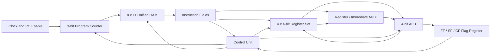

# 4_bit_CPU_with_11_bit_instructionSet-Architecture-Logisim-HDL-implementation-# 4-Bit CPU with an 11-Instruction ISA

This project implements a custom **4-bit CPU** with an **11-instruction instruction set architecture (ISA)** in two forms:

- a gate-level and component-level design in **Logisim**
- an equivalent implementation in **Hardware Description Language (HDL)**

The design is intended to demonstrate how a small processor combines a program counter, unified memory, register file, ALU, flag register, control unit, and external I/O into a complete instruction-execution datapath.

---

## Architecture Overview


### Top-level 4-bit CPU architecture



The top-level design follows a **single-cycle-style datapath**. The current instruction is read from memory using the Program Counter. The control unit decodes the opcode, the register file supplies the operands, and the ALU produces the result. At the active CPU clock edge, the processor updates the Program Counter, destination register, status flags, or memory according to the instruction.



---

## Processor Specifications

| Property | Implementation |
|---|---|
| Data width | 4 bits |
| Instruction width | 11 bits |
| Number of implemented instructions | 11 |
| Opcode width | 4 bits |
| Opcode field | `instruction[10:7]` |
| Program Counter width | 3 bits |
| Address space | 8 locations |
| Memory organization | 8 words × 11 bits |
| Memory capacity | 88 bits |
| Number of general-purpose registers | 4 |
| Register names | `R0`, `R1`, `R2`, `R3` |
| Register width | 4 bits |
| Register-address width | 2 bits |
| ALU width | 4 bits |
| ALU operation-select width | 2 bits |
| Number of ALU selections | Up to 4 |
| Status flags | Zero, Sign, Carry |
| Jump-address width | 3 bits |
| Control outputs | `OP`, `REG_EN`, `IMM_SEL`, `JMP_SEL`, `ST_SEL` |
| Memory model | Unified instruction and data memory |
| Main implementation tools | Logisim and HDL |

---


### Program Counter

The Program Counter is a **3-bit register**, so it can address eight memory locations:

```text
000 to 111
```

The next PC value is selected by `JMP_SEL`:

```text
JMP_SEL = 0  →  PC_next = PC + 1
JMP_SEL = 1  →  PC_next = JMP_ADR
```

Because the PC is 3 bits wide, sequential incrementing wraps around after address `111`.

### Unified 8 × 11 RAM

The CPU uses a single **8-word × 11-bit RAM** for both instructions and stored data.

Important ports include:

| Port | Width | Purpose |
|---|---:|---|
| `RA1` | 3 bits | Instruction-read address from the PC |
| `RA2` | 3 bits | Second RAM read address |
| `RD1` | 11 bits | Current instruction word |
| `RD2` | 11 bits | Second RAM read output |
| `WA` | 3 bits | Write address |
| `WD` | 11 bits | Write data |
| `WE` | 1 bit | Write enable |

The top-level circuit also includes manual `WA`, `WD`, and `WE` inputs for loading or testing RAM.

During a CPU store operation, `ST_SEL` overrides the manual write interface:

```text
Write address = ST_Ad
Write data    = zero_extend(ST_Data)
Write enable  = 1
```

Because instructions and data share the same RAM, a store operation can overwrite a memory location that previously contained an instruction. Programs must therefore reserve suitable locations for data.

### Register Set

The processor contains four 4-bit registers:

```text
R0, R1, R2, R3
```

Two 2-bit register-address fields select source registers:

```text
RA = instruction[6:5]
RB = instruction[4:3]
```

The `RA` field is also connected to the write-register selection. This creates a compact two-operand organization in which the first source register is also the destination:

```text
R[RA] ← ALU(R[RA], second_operand)
```

The register write is enabled by `REG_EN`.

The register-set module also exposes:

- `InD[3:0]` and `InE` for external input
- `OutD[3:0]` for external output
- direct observation of `R0`–`R3`

### Arithmetic Logic Unit

The ALU accepts two 4-bit operands:

```text
A = R[RA]
B = selected second operand
```

A 2-bit control signal selects one of up to four ALU operations:

```text
OP[1:0]
```

The Logisim project contains dedicated subcircuits for at least:

- 4-bit addition
- 1-bit full-adder logic
- 4-bit rotate-left

The complete mapping between `OP[1:0]` and the four ALU operations should match the `ALU_4bit` circuit and HDL source.

The ALU produces:

```text
R[3:0]  — 4-bit result
ZF      — Zero Flag
SF      — Sign Flag
CF      — Carry Flag
```

### Second-Operand Multiplexer

The ALU's second operand is selected by `IMM_SEL`.

```text
IMM_SEL = 0  →  B = R[RB]
IMM_SEL = 1  →  B = immediate value
```

The immediate operand is taken from:

```text
instruction[4:1]
```

This gives the CPU both register-register and register-immediate forms while reusing the same ALU datapath.

### Flag Register

The CPU stores three ALU status flags:

| Flag | Meaning |
|---|---|
| `ZF` | Set when the ALU result is zero |
| `SF` | Represents the sign or most-significant result condition |
| `CF` | Represents carry-out from the ALU |

The ALU outputs are captured by `FLAG_REG` on `CPU_CLK`. The registered outputs `dZF`, `dSF`, and `dCF` are fed back to the Control Unit for conditional control-flow decisions.

### Control Unit

The Control Unit receives:

```text
Opcode[3:0] = instruction[10:7]
dZF
dSF
dCF
```

It generates:

| Signal | Width | Function |
|---|---:|---|
| `OP` | 2 bits | Selects the ALU operation |
| `REG_EN` | 1 bit | Enables register write-back |
| `IMM_SEL` | 1 bit | Selects register or immediate ALU input |
| `JMP_SEL` | 1 bit | Selects sequential PC or jump target |
| `ST_SEL` | 1 bit | Activates the CPU-controlled RAM store path |

The Control Unit is therefore responsible for instruction decoding, write-back control, immediate selection, branch or jump decisions, and memory-store control.

---

## Instruction Encoding

The architecture uses an **11-bit instruction word**.

```text
Bit position:  10 9 8 7 | 6 5 | 4 3 | 2 1 0
               Opcode   | RA  | RB  | remaining fields
```

Different instruction classes reuse some of the lower bits.

### Register–Register ALU Format

```text
┌──────────────┬────────┬────────┬───────────┐
│ Opcode[10:7] │ RA[6:5]│ RB[4:3]│ Remaining │
└──────────────┴────────┴────────┴───────────┘
```

Operation:

```text
R[RA] ← ALU(R[RA], R[RB])
```

### Register–Immediate ALU Format

```text
┌──────────────┬────────┬──────────────────┬──────────┐
│ Opcode[10:7] │ RA[6:5]│ Immediate[4:1]   │ Bit 0    │
└──────────────┴────────┴──────────────────┴──────────┘
```

Operation:

```text
R[RA] ← ALU(R[RA], Immediate)
```

In the shown top-level wiring, instruction bit `0` appears unused or reserved for this format.

### Jump Format

```text
┌──────────────┬────────────────┬─────────────────────┐
│ Opcode[10:7] │ Address[6:4]   │ Remaining bits      │
└──────────────┴────────────────┴─────────────────────┘
```

Operation:

```text
PC ← instruction[6:4]
```

The Control Unit may use `ZF`, `SF`, or `CF` when deciding whether `JMP_SEL` should be asserted.

### Indirect Store Format

The store datapath uses two registers:

```text
ST_Data = R[RA]
ST_Ad   = R[RB][2:0]
```

The memory operation is:

```text
RAM[R[RB][2:0]] ← zero_extend_to_11_bits(R[RA])
```

This is an **indirect store** because the destination memory address is obtained from a register rather than being used directly from the instruction.

---

## Clock and Execution Control

The processor clock is generated using:

```text
CPU_CLK = CLK AND PC_Enable
```

`PC_Enable` allows the CPU to be paused or stepped during Logisim simulation.

The same CPU clock is distributed to the main state-holding elements, including:

- Program Counter
- Register Set
- Flag Register

The circuit therefore supports convenient manual observation of each instruction cycle.

> For an FPGA-oriented HDL implementation, a synchronous clock-enable condition is normally preferable to physically gating the clock with logic.

---

## Manual Programming and Debug Interface

The top-level Logisim circuit provides manual controls for:

- clock input
- CPU enable
- RAM write address
- RAM write data
- RAM write enable
- external register input data
- external register input enable

It also provides visual probes for:

- all eight RAM words
- all four CPU registers
- external output data
- Zero, Sign, and Carry flags

These features make it possible to load a program, inspect internal state, and execute the CPU one cycle at a time.

---

## Running the Logisim Design

1. Install Logisim or Logisim Evolution.
2. Open the circuit file from the `logisim` directory.
3. Use `WA`, `WD`, and `WE` to load the required 11-bit instruction words into RAM.
4. Disable manual RAM writing.
5. Reset or initialize the Program Counter and registers.
6. Enable `PC_Enable`.
7. Toggle the clock or enable simulation ticks.
8. Observe the RAM, registers, ALU result, flags, and output probes.

---

## Verification Goals

The Logisim and HDL versions should be tested for the same behavior:

- sequential PC increment
- jump-target loading
- register-register ALU operations
- register-immediate ALU operations
- register write enable
- Zero, Sign, and Carry flag generation
- conditional jump behavior
- indirect store addressing
- RAM write-data zero extension
- external input and output behavior
- clock-enable behavior
- wraparound of the 3-bit Program Counter

A useful verification method is to run the same 11-bit machine-code program in both implementations and compare the register, memory, flag, and output states after each clock cycle.


